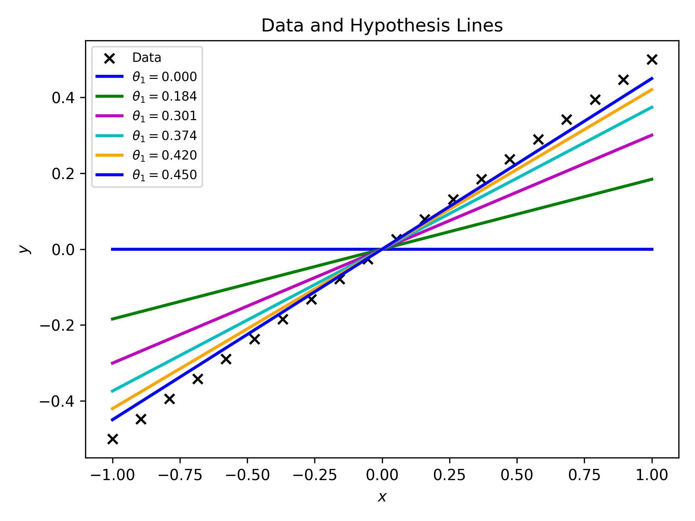
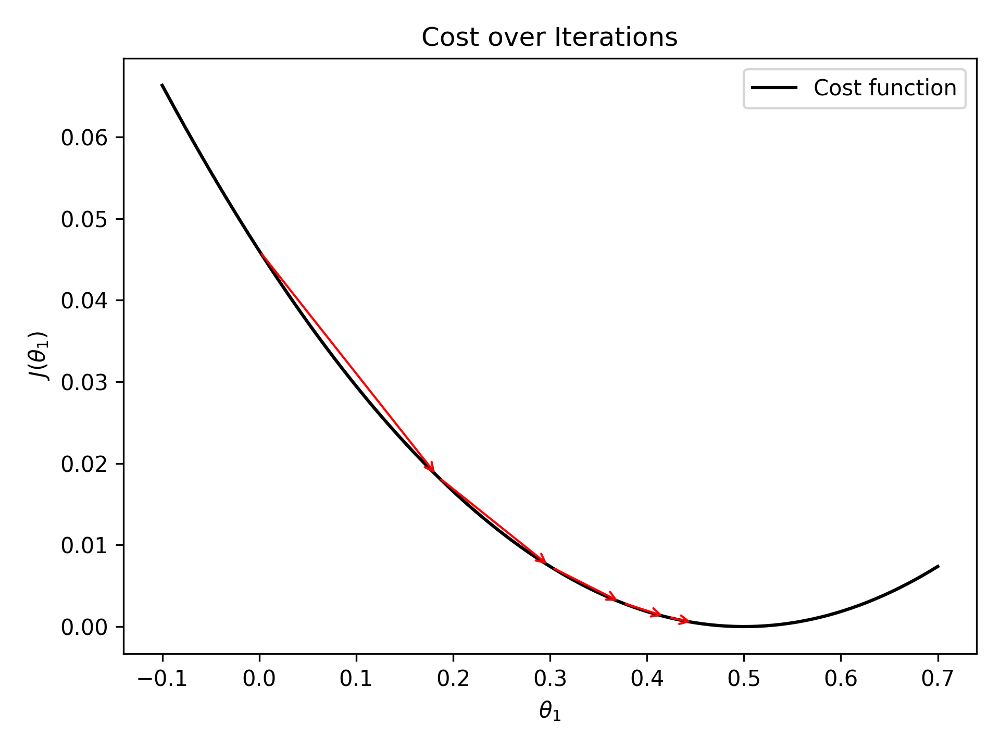

# Gradient Descent Visualization

This project visually demonstrates how gradient descent works in the context of fitting a line to data.

## 🚀 What This Project Covers

- ✅ Generated a synthetic dataset for regression
- ✅ Defined a hypothesis function and cost (MSE) function
- ✅ Implemented gradient descent from scratch
- ✅ Visualized:
  - Line gradually fitting the data (per iteration)
  - How weights (slope & intercept) move toward local minima

## 📊 Visual Outputs

### 1. Line Movement
Shows how the regression line updates after each iteration and fits the data better over time.

### 2. Weight Convergence
Plots the trajectory of weights on the cost surface, showing how they descend toward the minimum.

## 🧠 Key Concepts

- Gradient descent
- Cost function minimization
- Linear regression
- Weight updates
- Loss function

## 🛠️ Technologies Used

- Python
- NumPy
- Matplotlib
